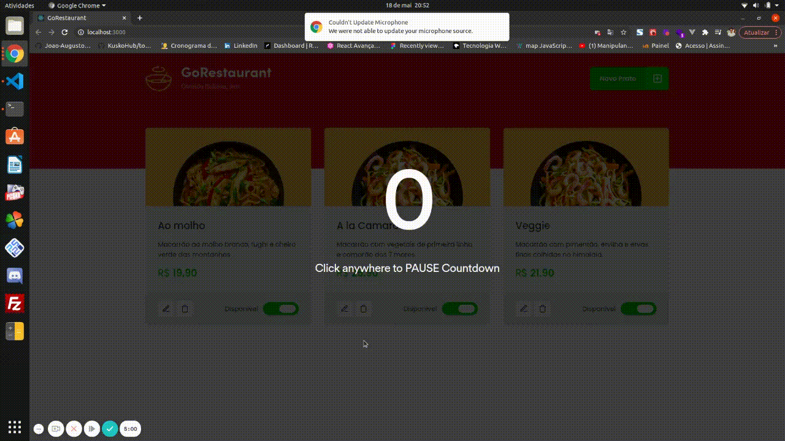

<div align=center>

  
  <br>
  <br>

<h3>

Projeto desenvolvido no Programa Ignite - Trilha ReactJS - da [Rocketseat], utilizando **ReactJS**, **Typescript** e **styled-components**.


</h3>



</div>

## 📚 **Sobre**

Migração da aplicação de Javascript para Typescript e de Class Components para Function Components.

<br>

### 📌  **Tecnologias utilizadas**
- [ReactJS]
- [TypeScript]
- [styled-components]
- [JSON-server]
- [axios]

<br>

<br>

### 🚀 **Mão na massa**

```bash
# Clone este repositório
$ git clone https://github.com/Joao-Augusto-Oliveira/gorestaurant

# Acesse a pasta do projeto no terminal/cmd
$ cd gorestaurant

# Instale as dependências
$ yarn

# Execute o JSON server 
$ yarn server

# Execute a aplicação em modo de desenvolvimento
$ yarn start

```

<br>
<br>

<h3 align="center">
Feito com 💜 por <a href="https://www.linkedin.com/in/joão-augusto-oliveira-dos-santos-9b0693195">João Augusto</a>
<br><br>
 
  
</a>
</h3>

<!-- Links -->

[Rocketseat]: https://rocketseat.com.br/
[ReactJS]: https://reactjs.org
[TypeScript]: https://www.typescriptlang.org/
[JSON-server]: https://github.com/typicode/json-server
[axios]: https://github.com/axios/axios
[styled-components]: https://styled-components.com/


